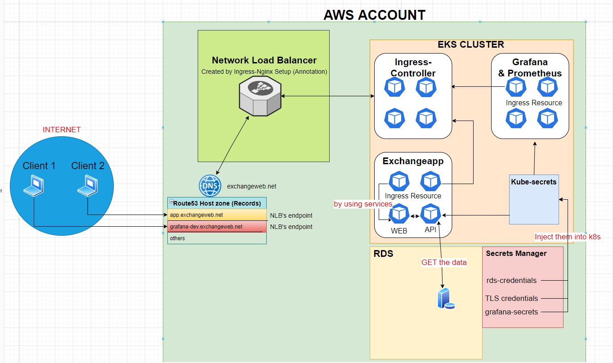

## Ingress Setup

Client => Host Domain(Route53) => ELB => Ingress-Controller => Ingress-Resources => Service => Pod

| Diagram    |
|------------|
||

Not a regular certificate, it is created for our Domain name. It means that certs know which domain's traffic will be protected. Because when we created our certs, we used to specify our Domain name (e.g "exchangeweb.net" and "*.exchangeweb.net"). Once you set those things, your certs are ready to use. And you will inject them into your cluster as a secret, then use it in your ingress-resource.
Ingress-controller will detect your resource by itself and redirect your traffic to your pods via services.
Secrets are already deployed in cluster, they don't depend on the ingress setup. I mean that Ingress doesn't trigger the setup of secrets. Ingress just use them once it is needed. It means you may have only tls secrets in your cluster without having ingress. But it doesn't effect unless you use them for your ingress resources.
